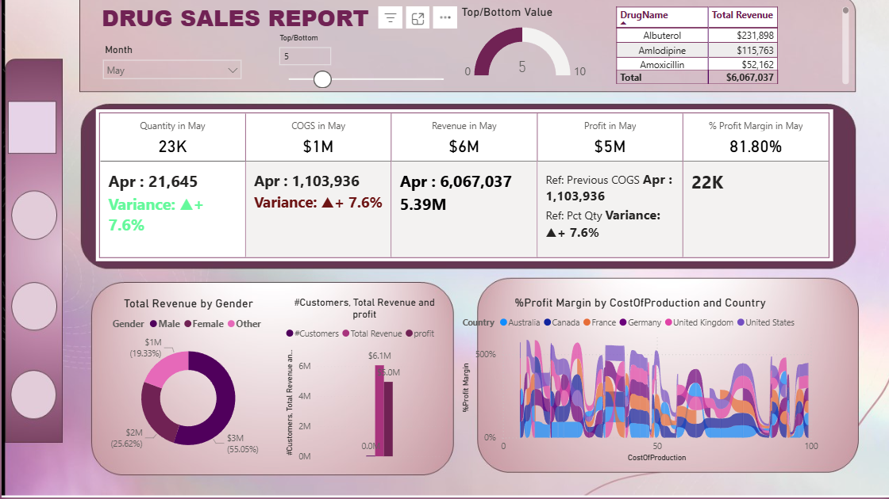
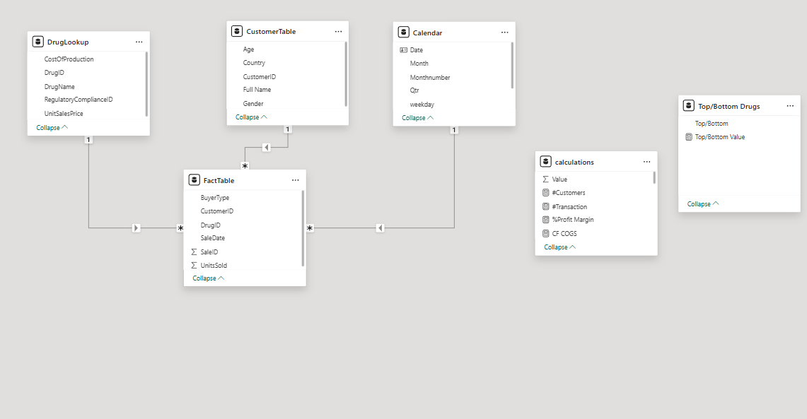

# 💊 Pharmaceutical Sales Strategy & Regulatory Analytics
**Interactive Business Intelligence Solution | Relational Modeling | DAX Logic**

<p align="center">
  
</p>

## 🚀 Explore the Interactive Project
To ensure 100% accessibility and transparency, I have provided two ways to access this analysis:

1. **[🌐 View Live Dashboard (Power BI Service)](https://app.powerbi.com/groups/me/reports/a9cf98cd-d871-4e78-83a5-adbdeb94becb?ctid=d7270324-ea10-47a1-ae5f-74dba073f8fd&pbi_source=linkShare )** *Best for a quick, cloud-hosted interactive overview.*
2. **[📥 Download .PBIX File (Google Drive)](https://drive.google.com/file/d/1EoJVB0yLUTPeeM6k1UeLywfyKyguIEUw/view?usp=sharing)** > **Note:** Google Drive may display this as a "compressed archive." Please click **Download** to open the file in Power BI Desktop to see the full interactivity and Star Schema.
   
## 📌 Project Overview
This project provides a deep-dive analysis of global pharmaceutical sales, transforming raw transactional data into actionable business intelligence. By building a robust **Star Schema** model, I identified key revenue drivers, peak sales periods, and the impact of regulatory compliance on market performance.

### 🔄 The "BI Tool" Evolution (Tableau vs. Power BI)
In my previous project (**Global Terrorism Analysis**), I utilized **Tableau** for high-impact geospatial storytelling. For this project, I deliberately transitioned to **Power BI** to master:
* **Complex Business Logic:** Using DAX for financial KPIs.
* **Data Engineering:** Normalizing flat files into a relational schema.
* **Enterprise Reporting:** Creating structured dashboards for operational decision-making.

## 📊 Business Problem
The pharmaceutical industry faces challenges in tracking performance across diverse global markets and varying regulatory statuses (FDA/EMA). This dashboard solves these issues by:
1.  **Standardizing Metrics:** Creating a single source of truth for Revenue, Profit, and COGS.
2.  **Identifying Peaks:** Analyzing weekday trends to optimize supply chain readiness.
3.  **Risk Management:** Correlating sales volume with regulatory compliance statuses.

 ## 🛠️ Technical Architecture: The Star Schema
To ensure high performance and scalability, I normalized the data into a **Relational Star Schema**:

* **Fact Table:** `FactTable` (Sales transactions, Units Sold, Buyer Type).
* **Dimension Tables:** * `DrugLookup`: Product pricing, production costs, and medical treatment categories.
    * `CustomerTable`: Demographic details (Age, Gender, Geography, Buyer Segment).
    * `RegulatoryCompliance`: Legal status (FDA, EMA, Pending Review).

 ## Data Architecture & Relational Mapping
The strength of this dashboard lies in its relational integrity. I implemented a Star Schema to connect transactional sales data with dimensional attributes, ensuring high-performance filtering and accurate DAX calculations.

  
  
Explanation for the Screenshot:
* One-to-Many Relationships: Mention that you used 1:* relationships (the lines with 1 and *) to connect DrugID and CustomerID from the lookup tables to the FactTable.
* Filter Flow: Explain that the filters flow from the Dimension tables (Lookup) down to the Fact table, which allows you to slice revenue by "Regulatory Body" or "Buyer Type" effortlessly.
 
## 🧠 Advanced DAX Logic (Technical Appendix)
I developed several custom measures to drive the dashboard's intelligence:

**1. Total Revenue (Iterative Logic)**
```dax
Total Revenue = SUMX('FactTable', 'FactTable'[UnitsSold] * RELATED('DrugLookup'[UnitSalesPrice]))

Profit Margin %

Code snippet
Profit Margin % = DIVIDE([Total Revenue] - [Total Cost], [Total Revenue], 0)

Month-over-Month (MoM) Growth

Code snippet
MoM Revenue Growth = 
VAR CurrentMonth = [Total Revenue]
VAR PreviousMonth = CALCULATE([Total Revenue], DATEADD('Date'[Date], -1, MONTH))
RETURN
DIVIDE(CurrentMonth - PreviousMonth, PreviousMonth)
```

## 💡 Key Insights & Business Recommendations
 **Revenue & Profitability Performance** 
  *  High-Margin Drivers: While generic drugs like Amoxicillin have high volume, premium drugs like Doxycycline and Atorvastatin contribute significantly higher profit margins.
  *  Cost Optimization: Products with production costs exceeding 60% of sales price are candidates for supply chain renegotiation.

**Sales Periodicity & Peak Trends**
 * Weekday Peak Analysis: Sales surge during the middle of the week (Tuesdays and Wednesdays).
 * Recommendation: Increase inventory stock-levels during these 48-hour windows to prevent stockouts.

**Regulatory & Compliance Impact**
 * Revenue Safeguard: Drugs with "Compliant" status (FDA/EMA) account for the majority of stable revenue.
 * Risk Mitigation: "Pending Review" products show 40% higher volatility, highlighting the financial importance of regulatory speed.

**Customer Segmentation & Geography**
 * Top-Tier Buyers: "Preferred Customers" represent a small fraction of count but over 60% of total revenue.
 * Geographic Dominance: The United States and Australia are the top revenue generators.

## 📂 Repository Contents
Drug Sales Analysis.pbix: The interactive Power BI dashboard.

DrugSalesData.csv: Normalized CSV files (Fact & Dimension tables).

Drug sales poster.pdf: High-level summary and Tableau comparison.

Drug Sales Analysis Write-up.docx: Detailed project methodology.

## 👤 Author
Tejashwini Saravanan [LinkedIn](https://www.linkedin.com/in/tejashwinisaravanan/)


